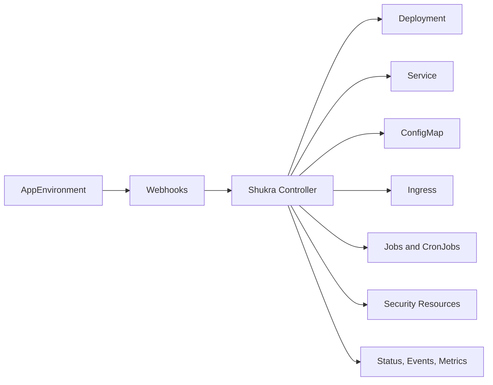

# Shukra Operator

<p align="center">
  
</p>

Shukra Operator — One YAML. Complete Environment.

[](https://github.com/sandy001-kki/Shukra/actions/workflows/ci.yaml)
[](https://github.com/sandy001-kki/Shukra/actions/workflows/release.yaml)
[](https://opensource.org/licenses/Apache-2.0)
[](https://github.com/users/sandy001-kki/packages/container/package/charts%2Fshukra-operator)
[](https://github.com/users/sandy001-kki/packages/container/package/shukra-operator)

Shukra Operator is a production-grade Kubernetes Operator that lets users define
an entire application environment through a single `AppEnvironment` custom
resource. Instead of maintaining many separate Kubernetes manifests, a user
declares the desired environment once and Shukra continuously reconciles the
required resources for them.

Repository: [github.com/sandy001-kki/Shukra](https://github.com/sandy001-kki/Shukra)

## Use it now

Shukra is a general Kubernetes Operator, not a Docker-only project.

You can use it on:

- Docker Desktop with kind or k3d for local development
- Minikube or k3s for small local clusters
- EKS, GKE, or AKS
- any Kubernetes cluster that meets the documented prerequisites

If you want the shortest path from clone to a working local Shukra environment:

```powershell
git clone https://github.com/sandy001-kki/Shukra.git
cd Shukra
powershell -ExecutionPolicy Bypass -File .\hack\bootstrap-local.ps1
go run .\cmd\shukra chat
```

Then try:

```text
status basic-app
list environments
diagnose basic-app
show resources for basic-app
show operator status
```

Or use the explicit CLI surfaces directly:

```powershell
go run .\cmd\shukra doctor -o json
go run .\cmd\shukra diagnose env basic-app -n default
go run .\cmd\shukra ask "How do I install Shukra on my own cluster?"
go run .\cmd\shukra completion powershell
```

If you want a full environment health check before anything else, run:

```powershell
go run .\cmd\shukra doctor
go run .\cmd\shukra doctor -o json
```

If you already have your own Kubernetes cluster, skip the local bootstrap flow
and read [docs/bring-your-own-cluster.md](docs/bring-your-own-cluster.md).

## About

Shukra Operator is a production-grade Kubernetes Operator for teams that want a
single, app-centric interface instead of maintaining many low-level manifests.
You define one `AppEnvironment`, and Shukra reconciles the compute, networking,
configuration, scaling, database workflow, backups, and security resources that
environment needs.

In simple terms, Shukra acts like the platform sage for your application:

- you describe the environment once
- Shukra creates and keeps the Kubernetes resources aligned
- status, conditions, events, and metrics tell you what is happening
- deletion is handled safely through finalizers instead of being left half-done

## Start here

| If you are... | Read this first | Then do this |
| --- | --- | --- |
| completely new to Docker or Kubernetes | [docs/beginner-guide.md](docs/beginner-guide.md) | [docs/getting-started.md](docs/getting-started.md) |
| a user with an existing Kubernetes cluster | [docs/bring-your-own-cluster.md](docs/bring-your-own-cluster.md) | [Helm values for production](docs/helm-values.md) |
| a user who wants the shortest path to a working environment | [Five minute quickstart](#five-minute-quickstart) | [Shukra CLI](#shukra-cli) |
| a contributor who wants architecture and release context | [docs/learning-path.md](docs/learning-path.md) | [CONTRIBUTING.md](CONTRIBUTING.md) |

## At a glance

| One thing you write | What Shukra creates for you |
| --- | --- |
| `AppEnvironment` YAML | `Deployment`, `Service`, `ConfigMap`, `Ingress`, `HPA`, migration `Job`, restore `Job`, backup `CronJob`, `NetworkPolicy`, `PDB` |



## Quick links

- [Completely new to Docker or Kubernetes?](#completely-new-to-docker-or-kubernetes)
- [One-command local bootstrap](#one-command-local-bootstrap)
- [Bring your own cluster](#bring-your-own-cluster)
- [Install from OCI Helm chart](#install-from-oci-helm-chart)
- [Helm values for production](#helm-values-for-production)
- [Shukra CLI](#shukra-cli)
- [Shukra Chat](#shukra-chat)
- [Shukra AI roadmap](#shukra-ai-roadmap)
- [Examples included in this repo](#examples-included-in-this-repo)
- [Documentation](#documentation)
- [Security policy](SECURITY.md)
- [Roadmap](ROADMAP.md)

## Completely new to Docker or Kubernetes?

Read [docs/beginner-guide.md](docs/beginner-guide.md) first.

That guide explains:

- what Docker is
- what Kubernetes is
- what Helm does
- what an Operator is
- how Shukra fits into that stack
- how to use the one-command bootstrap

## Bring your own cluster

Shukra is designed for any compatible Kubernetes cluster, not just the local
kind workflow in this repository.

If you already operate a cluster, the normal path is:

1. make sure `kubectl` points to the target cluster
2. install cert-manager if your platform does not already provide webhook TLS management
3. install Shukra with Helm
4. apply an `AppEnvironment`
5. use `shukra doctor`, `shukra chat`, or `kubectl` to inspect status

Read the full cluster-agnostic guide here:

- [docs/bring-your-own-cluster.md](docs/bring-your-own-cluster.md)
- [docs/helm-values.md](docs/helm-values.md)

## Why this project exists

Running an application in Kubernetes normally requires several objects:

- a `Deployment` for Pods
- a `Service` for internal networking
- a `ConfigMap` for configuration
- one or more `Secret` references
- an `Ingress` for external access
- `HorizontalPodAutoscaler` rules
- migration and restore `Job` objects
- backup `CronJob` objects
- `NetworkPolicy`
- `PodDisruptionBudget`

Managing those objects by hand becomes repetitive and error-prone. Shukra raises
the abstraction level. Users describe the application and its operational needs,
and the operator turns that into the lower-level Kubernetes resources.

## What Shukra manages

Depending on the `AppEnvironment` spec, Shukra can create and manage:

- `Deployment`
- `Service`
- `ConfigMap`
- references to existing `Secret` objects
- `Ingress`
- `HorizontalPodAutoscaler`
- migration `Job`
- restore `Job`
- backup `CronJob`
- `NetworkPolicy`
- `PodDisruptionBudget`

On deletion, Shukra runs finalizer-driven cleanup before releasing the custom
resource.

## Main features

- One high-level `AppEnvironment` API for full environment lifecycle management
- Explicit API versioning with `v1alpha1` to `v1beta1` conversion
- Mutating, validating, and conversion webhooks
- Idempotent reconciliation using controller-runtime
- Finalizers for safe deletion workflows
- Status conditions and phase reporting on the custom resource
- Structured logging, Kubernetes events, and Prometheus metrics
- Leader election for production-safe multi-replica deployments
- Helm chart, generated manifests, examples, and GitHub Actions workflows

## Architecture overview

```text
AppEnvironment
  -> mutating webhook
  -> validating webhook
  -> conversion webhook
  -> Shukra controller
  -> ordered child-resource reconciliation
  -> status, conditions, events, metrics
```

High-level reconcile order:

1. Fetch `AppEnvironment`
2. Handle deletion and finalizers
3. Respect paused mode
4. Validate dependencies and tenancy rules
5. Reconcile ConfigMap, Service, Deployment, HPA, migration, restore, Ingress,
   NetworkPolicy, PDB, and backup CronJob
6. Update status and conditions

More detail is available in [docs/architecture.md](docs/architecture.md).

## Who should use it

Shukra is useful for:

- application developers who want fewer Kubernetes details
- platform teams enforcing a standard app deployment contract
- DevOps and SRE teams that want safer lifecycle automation
- organizations deploying many similar services across namespaces

## Prerequisites

- Go 1.21
- Kubernetes 1.26+
- Helm 3.13+
- cert-manager 1.13+
- Docker and kind for local cluster testing only

## Quick install from GitHub checkout

Clone the repository:

```bash
git clone https://github.com/sandy001-kki/Shukra.git
cd Shukra
```

Install the operator into a cluster:

```bash
helm install shukra-operator charts/shukra-operator \
  -n shukra-system \
  --create-namespace
```

That chart installs:

- the `AppEnvironment` CRD
- the controller Deployment
- RBAC
- webhook configuration
- cert-manager issuer and certificate resources
- metrics and webhook Services

For a cluster-agnostic install flow with OCI chart examples and production
guidance, see [docs/bring-your-own-cluster.md](docs/bring-your-own-cluster.md).

## Five minute quickstart

If you are new to the project, this is the shortest useful path:

```bash
git clone https://github.com/sandy001-kki/Shukra.git
cd Shukra
helm install shukra-operator charts/shukra-operator -n shukra-system --create-namespace
kubectl apply -f examples/basic.yaml
kubectl get appenvironment basic-app -n default -o yaml
kubectl get deploy,svc,cm,pods -n default
```

If you want a more beginner-friendly walkthrough, read
[docs/getting-started.md](docs/getting-started.md).

If you want a structured progression from total beginner to contributor, read
[docs/learning-path.md](docs/learning-path.md).

If you want the command-line interface guide, read
[docs/cli.md](docs/cli.md).

If you already have a Kubernetes cluster and want the non-local install path,
read [docs/bring-your-own-cluster.md](docs/bring-your-own-cluster.md).

## Shukra Chat

If you want a more assistant-like terminal experience, use the new chat mode:

```powershell
go run .\cmd\shukra chat
```

You can speak to it in simple English:

```text
status basic-app
list environments
show resources for basic-app
diagnose basic-app
show operator status
apply examples/basic.yaml
show operator logs
pause basic-app
resume basic-app
bootstrap local
quit
```

You can also run one English command without opening the full prompt:

```powershell
go run .\cmd\shukra chat --message "status basic-app"
```

This mode is designed to work cleanly in PowerShell for users who prefer
conversational commands over remembering many CLI flags.

It also supports operator-aware inspection flows such as:

- listing environments
- showing child resources
- diagnosing environment health
- showing operator pod status

There is also a deterministic health-check command for both local and
bring-your-own-cluster setups:

```powershell
go run .\cmd\shukra doctor
```

What works today:

- English-first control commands in PowerShell
- live status and diagnosis against the cluster
- operator install/bootstrap flows
- safe lifecycle actions such as apply, pause, resume, delete, migrate, and restore

For non-local clusters, `shukra doctor` treats Docker as optional and focuses on
cluster reachability, CRDs, operator Pods, and cert-manager state.

If you prefer explicit commands over chat, Shukra also includes:

- `shukra diagnose env <name>` for direct environment diagnosis
- `shukra diagnose operator` for operator pod inspection
- `shukra ask "<question>"` for grounded answers from local Shukra docs
- `shukra completion powershell` for PowerShell tab completion setup

## Shukra AI roadmap

Shukra can evolve into a real AI-assisted operator workflow, but there is an
important engineering boundary:

- without API keys and without a local model runtime, we can prepare the full
  data, training, tuning, and evaluation pipeline
- to answer users like a real AI assistant, the project still needs a model
  runtime somewhere, either local or hosted

This repository now includes a concrete AI foundation:

- [docs/ai-roadmap.md](docs/ai-roadmap.md)
  phased plan from retrieval to tuned Shukra assistant
- [docs/ai-architecture.md](docs/ai-architecture.md)
  component design, guardrails, and deployment options
- [ai/README.md](ai/README.md)
  workspace layout for datasets, prompts, and evaluation assets
- `make ai-dataset`
  generate a Shukra-specific JSONL dataset from repo docs and examples
- `make ai-eval`
  validate that required docs and dataset outputs exist before training work

The recommended order is:

1. retrieval and grounded answers from Shukra docs
2. structured Shukra instruction dataset generation
3. fine-tuning a small open model on Shukra tasks
4. CLI integration with safe execution guardrails

## Demo snapshots

Live cluster snapshots generated from a working local Shukra run:

`AppEnvironment` present in the cluster:


Generated Kubernetes resources:


Operator log sample:


## One-command local bootstrap

If you want Shukra to set up a complete local workflow for you on Windows, run:

```powershell
powershell -ExecutionPolicy Bypass -File .\hack\bootstrap-local.ps1
```

That script will:

- start Docker Desktop
- create a kind cluster
- install cert-manager
- build the operator image
- load the image into kind
- install the Shukra Helm chart
- apply `examples/basic.yaml`
- wait for the sample Deployment rollout

There is also a matching Make target:

```bash
make bootstrap-local
```

You can run the same flow through the CLI:

```powershell
shukra bootstrap local
```

This workflow is optional convenience for local development only. It is not
required for users who already have a Kubernetes cluster.

## Install from OCI Helm chart

If a published chart is available in GHCR, install it directly:

```bash
helm install shukra-operator oci://ghcr.io/sandy001-kki/charts/shukra-operator \
  --version 0.2.3 \
  -n shukra-system \
  --create-namespace
```

The matching published controller image for that release is:

```text
ghcr.io/sandy001-kki/shukra-operator:0.2.3
```

The GitHub release also includes standalone CLI binaries for Linux, Windows,
and macOS.

## Helm values for production

The Helm chart supports production-oriented configuration through
`charts/shukra-operator/values.yaml`.

Common areas to tune:

- image repository, tag, and pull policy
- replica count
- leader election namespace
- watch namespace
- max concurrent reconciles
- controller CPU and memory
- security context
- cert-manager issuer settings
- metrics exposure
- service account name

Read the full values guide here:

- [docs/helm-values.md](docs/helm-values.md)
- [charts/shukra-operator/values-production.yaml](charts/shukra-operator/values-production.yaml)

## Shukra CLI

Shukra ships with a companion CLI that helps users install the operator,
generate starter manifests, inspect environments, and trigger common lifecycle
actions.

Build it locally:

```bash
make cli-build
```

Common commands:

```bash
shukra version
shukra install --operator-namespace shukra-system
shukra doctor --output json
shukra diagnose env demo-app -n default
shukra diagnose operator
shukra ask "How do I install Shukra on EKS?"
shukra env init demo-app --image nginx:1.27 --output demo-app.yaml
shukra env apply -f demo-app.yaml
shukra env status demo-app -n default
shukra env pause demo-app -n default
shukra env resume demo-app -n default
```

For the full command guide, see [docs/cli.md](docs/cli.md).

## First user workflow

After the operator is installed, a new user only needs to apply an
`AppEnvironment`.

Use the basic example:

```bash
kubectl apply -f examples/basic.yaml
kubectl get appenvironments.apps.shukra.io
kubectl describe appenvironment basic-app
kubectl get deploy,svc,cm -n default
```

The shipped basic example is:

```yaml
apiVersion: apps.shukra.io/v1beta1
kind: AppEnvironment
metadata:
  name: basic-app
spec:
  app:
    image: nginx:1.27
    containerPort: 80
    livenessProbe:
      httpGet:
        path: /
        port: 80
      initialDelaySeconds: 10
    readinessProbe:
      httpGet:
        path: /
        port: 80
      initialDelaySeconds: 5
    replicas: 2
    resources:
      requests:
        cpu: 100m
        memory: 128Mi
      limits:
        cpu: 500m
        memory: 256Mi
  service:
    enabled: true
```

What happens when that file is applied:

- Shukra validates the spec
- adds defaults where needed
- creates a `ConfigMap`
- creates a `Service`
- creates a `Deployment`
- updates `status.phase`, `status.conditions`, and child resource names

## What a user edits

Users mainly work with the `spec` fields on `AppEnvironment`.

Key sections include:

- `spec.app`
  image, replicas, ports, probes, environment, resources, secret references
- `spec.config`
  key-value app configuration
- `spec.service`
  internal traffic exposure
- `spec.ingress`
  external hostname and routing
- `spec.database`
  database mode and referenced secret
- `spec.migration`
  migration job configuration and `migrationID`
- `spec.restore`
  restore workflow and `triggerNonce`
- `spec.backup`
  backup scheduling and destination
- `spec.autoscaling`
  HPA behavior
- `spec.security`
  network policy, PDB, security context
- `spec.paused`
  stop mutations while still refreshing status

## Examples included in this repo

- [examples/basic.yaml](examples/basic.yaml)
  Smallest useful app environment
- [examples/ingress.yaml](examples/ingress.yaml)
  App with external ingress configuration
- [examples/autoscaling.yaml](examples/autoscaling.yaml)
  App with HPA configuration
- [examples/migration.yaml](examples/migration.yaml)
  App with database and migration workflow
- [examples/restore.yaml](examples/restore.yaml)
  App with backup and restore flow
- [examples/paused.yaml](examples/paused.yaml)
  App with reconciliation paused
- [examples/production-web.yaml](examples/production-web.yaml)
  Production-oriented web service example with ingress, autoscaling, backup, and PDB

## How users observe their environment

The `AppEnvironment` status is the first place to inspect.

Important status fields include:

- `status.phase`
- `status.conditions`
- `status.childResources`
- `status.lastError`
- `status.failureCount`
- `status.lastAppliedMigrationID`
- `status.lastProcessedRestoreNonce`

Useful commands:

```bash
kubectl get appenvironment <name> -o yaml
kubectl describe appenvironment <name>
kubectl get deploy,svc,ingress,hpa,job,cronjob -n <namespace>
kubectl logs -n shukra-system deploy/shukra-operator
```

## Backup and restore

Backups are declared in `spec.backup` and materialize as a managed `CronJob`.
Restore runs are controlled by `spec.restore.triggerNonce`. Shukra only creates
a new restore `Job` when the nonce changes, which makes restore execution
intentional and idempotent.

For a deeper hands-on walkthrough, see
[docs/migration-restore-walkthrough.md](docs/migration-restore-walkthrough.md).

## Namespace tenancy and secret model

Shukra treats a Kubernetes namespace as the tenant boundary.

Rules enforced by the operator:

- secret references must stay in the same namespace
- service account references must stay in the same namespace
- Shukra never creates secret objects from inline values
- Shukra never logs secret values
- ingress host uniqueness is enforced cluster-wide

This makes the operator compatible with secret managers such as External
Secrets Operator, as long as the materialized Secret exists in the same
namespace.

See [docs/tenancy.md](docs/tenancy.md) for the full model.

## Local development workflow

Common workflow:

```bash
make generate
make manifests
make test
make run
```

Other useful tasks:

```bash
make lint
make docker-build
make helm-package
make docs-generate
```

## Local cluster workflow

For contributors who want to run everything end-to-end locally:

1. Start Docker Desktop
2. Create a kind cluster
3. Install cert-manager
4. Build the operator image
5. Load the image into kind
6. Install the Shukra chart
7. Apply an example manifest

This repository has been validated through that flow locally.

## Release and versioning policy

Shukra follows semantic versioning.

Git tags like `v0.1.0` drive:

- the container image tag
- the Helm chart `version`
- the Helm chart `appVersion`

The git tag keeps its leading `v`, but published OCI artifact versions do not.
For example:

- Git tag: `v0.2.3`
- GHCR image: `ghcr.io/sandy001-kki/shukra-operator:0.2.3`
- OCI chart version: `0.2.3`

Charts are published as OCI artifacts to:

`oci://ghcr.io/sandy001-kki/charts/shukra-operator`

## CI and release

The repository contains:

- `.github/workflows/ci.yaml`
  lint, vet, generate, and test validation
- `.github/workflows/release.yaml`
  multi-arch image build, Helm packaging, and release publishing

## Documentation

- [docs/beginner-guide.md](docs/beginner-guide.md)
- [docs/getting-started.md](docs/getting-started.md)
- [docs/bring-your-own-cluster.md](docs/bring-your-own-cluster.md)
- [docs/helm-values.md](docs/helm-values.md)
- [docs/cloud-eks.md](docs/cloud-eks.md)
- [docs/cloud-gke.md](docs/cloud-gke.md)
- [docs/cloud-aks.md](docs/cloud-aks.md)
- [docs/gitops-argocd.md](docs/gitops-argocd.md)
- [docs/gitops-flux.md](docs/gitops-flux.md)
- [docs/observability.md](docs/observability.md)
- [docs/learning-path.md](docs/learning-path.md)
- [docs/cli.md](docs/cli.md)
- [docs/ai-roadmap.md](docs/ai-roadmap.md)
- [docs/ai-architecture.md](docs/ai-architecture.md)
- [docs/migration-restore-walkthrough.md](docs/migration-restore-walkthrough.md)
- [docs/api.md](docs/api.md)
- [docs/architecture.md](docs/architecture.md)
- [docs/tenancy.md](docs/tenancy.md)
- [docs/troubleshooting.md](docs/troubleshooting.md)

The API reference is generated by `make docs-generate` using `crd-ref-docs`.

## Contributing

See [CONTRIBUTING.md](CONTRIBUTING.md) for branch workflow, generation
requirements, and test expectations.

## Security

See [SECURITY.md](SECURITY.md) for private vulnerability reporting guidance and
supported release expectations.

## Support

See [SUPPORT.md](SUPPORT.md) for the recommended support path, issue-routing
guidance, and what information to include when asking for help.

## Changelog

See [CHANGELOG.md](CHANGELOG.md) for release highlights and user-visible
updates.

## Roadmap

See [ROADMAP.md](ROADMAP.md) for the next milestones planned for Shukra.

## In one sentence

Shukra Operator lets a user describe an application environment once and have
Kubernetes continuously build, maintain, and clean up the underlying runtime
resources for them.

